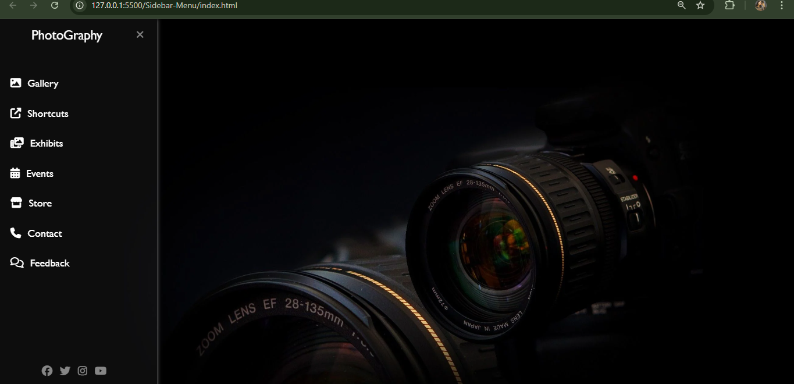

# Sidebar Menu

This is a simple and responsive sidebar navigation menu created using HTML and CSS.  
It can be used in websites, dashboards, or admin panels.

## Features

- Responsive design
- Clean and modern layout
- Easy to customize
- Built using only HTML and CSS

## 🌐 Live Demo
👉 [Click here to view](https://umramirza.github.io/Sidebar-menu/)

## 📸 Preview

## 📁 Project Structure

sidebar-menu/

├── index.html → Main HTML file

├── style.css → Styling for sidebar

├── cameraaa.webp → Image used in design

└── README.md → Project documentation

---

## How to Use

1. Download or clone this repository.
2. Open the project folder.
3. Open the `index.html` file in any web browser to view the sidebar layout.

## Built With

- HTML5
- CSS3

## 📄 License  
This project is licensed under the [MIT License](LICENSE).  
© 2025 Umra Mirza

## 🙋‍♀️ Author

**Umra Mirza**  
🎓 BCA Student | 💻 Frontend Developer  
🔗 [GitHub](https://github.com/umramirza) • [LinkedIn](https://www.linkedin.com/in/umra-mirza-4525962a2)

